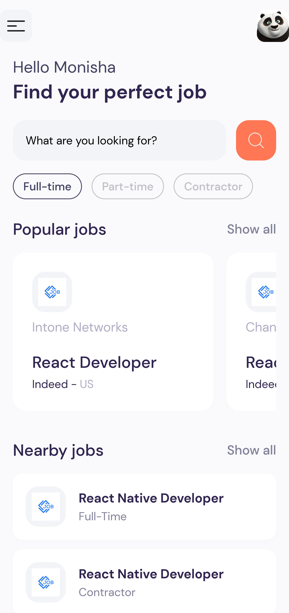

<div align="center">
  <h3 align="center">React Native Job Finder App</h3>
</div>



## <a name="table">Table of Contents</a>

1. [Introduction](#introduction)
2. [Tech Stack](#tech-stack)
3. [Features](#features)
4. [Quick Start](#quick-start)

## <a name="introduction">Introduction</a>

A hands-on experience in React Native development, from understanding the basics to building a feature-rich app with a focus on UI/UX, external data integration, and best practices.

## <a name="tech-stack">Tech Stack</a>

- Node.js
- React Native
- Axios
- Expo
- Stylesheet

## <a name="features">Features</a>

**Visually Appealing UI/UX Design**: Develop an aesthetically pleasing user interface using React Native components.

**Third Party API Integration**: Fetch data from an external API and seamlessly integrate it into the app.

**Search & Pagination Functionality**: Implement search functionality and pagination for efficient data navigation.

**Custom API Data Fetching Hooks**:Create custom hooks for streamlined and reusable API data fetching.

**Dynamic Home Page**: Explore diverse jobs from popular and nearby locations across different categories.

**Browse with Ease on Explore Page**: Page: Navigate through various jobs spanning different categories and types.

**Detailed Job Insights**: View comprehensive job details, including application links, salary info, responsibilities, and qualifications.

**Tailored Job Exploration**: Find jobs specific to a particular title

**Robust Loading and Error Management**: Ensure effective handling of loading processes and error scenarios.

**Optimized for All Devices**: A responsive design for a seamless user experience across various devices.

and many more, including code architecture and reusability

## <a name="quick-start">Quick Start</a>

Follow these steps to set up the project locally on your machine.

**Prerequisites**

Make sure you have the following installed on your machine:

- [Git](https://git-scm.com/)
- [Node.js](https://nodejs.org/en)
- [npm](https://www.npmjs.com/) (Node Package Manager)

**Cloning the Repository**

```bash
git clone https://github.com/...
cd ...
```

**Installation**

Install the project dependencies using npm:

```bash
npm install
```

**Set Up Environment Variables**

Create a new file named `.env` in the root of your project and add the following content:

```env
X-RapidAPI-Key=
```

Replace the placeholder values with your actual credentials. You can obtain these credentials by signing up on the [RapidAPI website](https://rapidapi.com/letscrape-6bRBa3QguO5/api/jsearch).

**Running the Project**

```bash
npm start
```

Open [http://localhost:3000](http://localhost:3000) in your browser to view the project.
